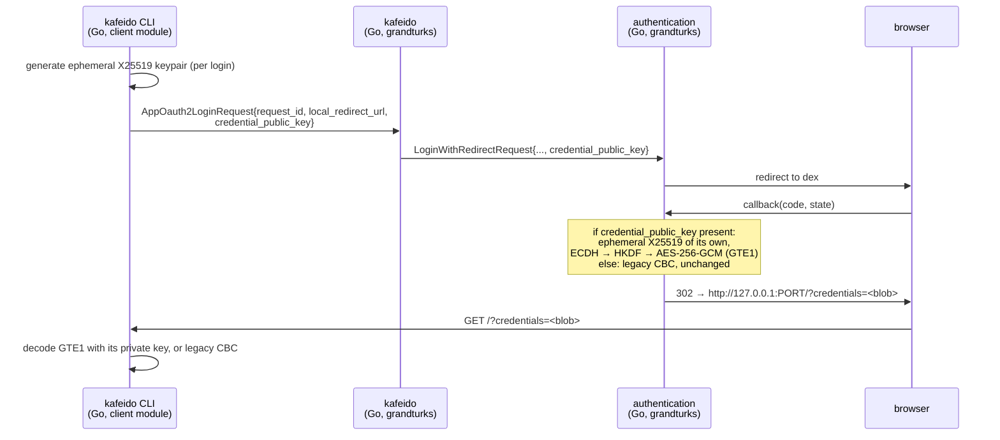

# Design: authenticated encryption for the oauth2 callback credential

**Date:** 2026-08-17
**Status:** proposed
**Stack:** Go 1.22 (stdlib crypto), protobuf/grpc-gateway contracts owned by grandturks; no new services, no new languages

## Problem

`kafeido login` finishes by having the authentication service redirect the
browser to a loopback URL carrying the user's access token, encrypted:

```
http://127.0.0.1:<ephemeral>/?credentials=<base64url blob>
```

The blob is AES-256-**CBC**, unauthenticated, under a key that is a source
literal (`XbPtIKLGaN5Xcf3ALKsvYJdgKeutjwuR` in
`grandturks/common/encryption/aes.go`) with a **fixed IV**. Three consequences,
all measured rather than assumed:

1. **No integrity.** A modified ciphertext decrypts to something — 4 of 500
   wrong-key decodes survive a padding check and return garbage as plaintext
   (grandturks-client#29). CBC is malleable, so edits are targeted, not just
   noise.
2. **No confidentiality against anyone holding the CLI.** The key is compiled
   into a binary that is published as a release asset. Anyone who can read the
   callback URL can also download the key. A fixed IV additionally makes the
   encryption deterministic: the same plaintext always produces the same blob.
3. **The decrypted bytes are trusted.** They are parsed as a query string and
   one field becomes the access token written to `~/.kafeidoconfig`.

Two structural facts discovered while designing this, which the fix has to
address or it will not hold:

- **There are two copies of this code and the CLI runs the other one.**
  `grandturks/app/kafeido/cli/main.go` calls
  `kafeidocmd.SetEncryptor(encryption.DefaultAESKey)` — grandturks'
  `common/encryption`. `grandturks-client/pkg/encryption/aes.go` is a
  near-identical copy that the shipped CLI never executes. The panic fix in
  grandturks-client#23 therefore landed in the copy nobody runs; the live
  binary still panics on malformed input. This is the same failure the
  `openapierrors` tests already document ("a fix that lands in the copy nobody
  runs"), one package over.
- **The client repo's own `main` never injects an encryptor at all**, so a
  binary built from `grandturks-client/app/kafeido/cli` has a nil `Encryptor`
  and nil-dereferences on the callback. Tracked separately; it decides which
  artifact this design's tests must cover.

## Design

One implementation, one wire format, and a per-login key so there is no shared
secret to leak.



### Components

| Component | Responsibility | Change |
|---|---|---|
| `grandturks-client/pkg/encryption` | **the** implementation: format codec, GCM seal/open, ephemeral keypair, legacy CBC decode | rewritten |
| `grandturks/common/encryption` | re-exports the above; keeps `DefaultAESKey` only as the legacy decrypt key | reduced to a shim, deleted after the window |
| `grandturks` authentication service | picks the format per request and encrypts | `Callback` branch |
| `grandturks-client` CLI `cmd_login.go` | generates the keypair, sends the public key, decrypts the reply | login command |
| protos (`kafeido.proto`, `authentication.proto`) | carry the public key | one optional field each |

### Wire format

```
GTE1 blob := "GTE1" ‖ server_ephemeral_pub(32) ‖ nonce(12) ‖ ciphertext ‖ tag(16)
             └─ AAD covers "GTE1" ‖ server_ephemeral_pub ‖ request_id ─┘

legacy    := <AES-CBC blocks, no marker>          (decrypt-only, deprecated)
```

The whole blob is base64url-encoded, exactly as today, so the URL shape and
everything that logs or proxies it are unchanged.

- **Version marker first.** A decoder dispatches on the 4-byte magic; anything
  else is legacy. A legacy blob starts with those four bytes with probability
  2⁻³², and the consequence is a decode error and a retried login, not a wrong
  plaintext. Written down rather than left to be discovered.
- **The magic is inside the AAD**, so it cannot be stripped to force a
  downgrade — a v2 blob presented as v1 fails the tag check.
- **`request_id` is in the AAD**, which binds a blob to the login that asked
  for it: a captured credential replayed at a later login fails to open,
  instead of being caught one layer up by the existing `reqId` comparison.
- **Nonce is random per message** (12 bytes, GCM standard). The key is used
  once, so nonce reuse is not reachable even in principle.

### Key exchange, and why not a shared key

The CLI generates an X25519 keypair per login and sends the **public** half in
the login request. The server generates its own ephemeral pair, does ECDH,
derives the AES-256 key with HKDF-SHA256 (`info = "grandturks/oauth2-callback
v1"`), and returns its public key inside the blob.

The public key travelling through the browser (it rides the same path as
`state`) is harmless — that is the property a public key has and a shared
symmetric key does not. Nothing durable is stored, and there is no build-time
secret left to extract from a published binary.

**This also removes the negotiation problem.** The presence of the field *is*
the capability signal: a CLI that sends a public key can read GTE1, and one
that does not gets the legacy format it has always got. No version matrix, no
flag day, no need to know what CLI versions are deployed — which matters,
because there is no telemetry that could answer that.

### Language choices

| Component | Language | Why this one | Type gate in CI |
|---|---|---|---|
| `pkg/encryption` (client) | Go | it is a library inside an existing Go module, using `crypto/ecdh`, `crypto/cipher` and `crypto/rand` from the standard library | `go vet` + `go test` (grandturks-client#15's lane) |
| authentication service | Go | existing service, unchanged deployment | grandturks' `Build` lane |
| CLI login command | Go | existing command in the client module | same as above |

No new language, no new service, no new deployable. One dependency moves from
indirect to direct: `golang.org/x/crypto/hkdf` (already in both modules' graphs;
`crypto/hkdf` is stdlib only from Go 1.24, and this module targets 1.22).

## Contracts

| Boundary | Contract | Source of truth |
|---|---|---|
| CLI → kafeido | `AppOauth2LoginRequest.credential_public_key` (optional bytes) | `grandturks/app/kafeido/proto/kafeido.proto` |
| kafeido → authentication | `LoginWithRedirectRequest.credential_public_key` (optional bytes) | `grandturks/components/authentication/proto/authentication.proto` |
| authentication → CLI | the GTE1 blob above | `grandturks-client/pkg/encryption`, as code plus golden vectors |

Both proto fields are **optional and additive**: absent behaves exactly as
today. Generated clients are regenerated, never hand-edited — which is why the
sequencing below has the proto change land first.

## Test strategy

Written before the implementation, per component.

**`pkg/encryption` (client) — unit, table-driven**

- round trip across payload sizes including empty and a realistic
  `reqId=…&token=…&timestamp=…`
- **tamper matrix**: flip a byte in each region — magic, server public key,
  nonce, ciphertext, tag — and assert `Open` fails for every one. This is the
  assertion the current code cannot make at all
- truncation at every boundary (shorter than magic, than the key, than the
  nonce, than the tag)
- wrong private key fails
- `request_id` mismatch fails (the AAD binding)
- legacy detection: a CBC blob routes to the legacy decoder; a GTE1 blob never
  does
- **golden vectors**: a committed table of (private key, blob, plaintext)
  exercised by both repos — see below
- **`go test -fuzz` on the decoder**, seeded with the golden vectors. The bug
  in grandturks-client#23 was two panics on malformed input; fuzzing is what
  proves the replacement has none, rather than the four hand-written cases that
  found the first two

**Cross-repo contract test — the important one**

grandturks already depends on grandturks-client, so its tests can import the
client's decoder directly:

```go
// grandturks/components/authentication/pkg/server/callback_test.go
blob := buildCallbackCredential(t, reqID, token, clientPub)   // server code
got, err := clientenc.OpenCredential(clientPriv, reqID, blob) // client code
```

If either side drifts, that test fails — the schema is not described twice, it
is exercised from both ends in one assertion. The golden vectors give the same
guarantee in the other direction: the client's tests decode blobs the server
produced.

**authentication service (grandturks) — unit, table-driven**

- `credential_public_key` absent → legacy CBC blob, byte-identical to today
- present → GTE1, and the redirect URL shape is unchanged
- a malformed/short public key → `InvalidArgument`, not a panic and not a
  silent fallback to legacy (a downgrade an attacker could induce)

**CLI (client) — handler test**

- callback handler with a valid blob → token stored
- with a blob from a different login (`reqId` mismatch) → 400, nothing stored
- with garbage → 500 with a message, **no panic** (the regression guard for
  grandturks-client#23, this time in the code that actually runs)

**e2e** — the existing login journey, unchanged; it is what proves dex, the
gateway and the loopback still line up.

### Feasibility, checked rather than assumed

The format above was prototyped end to end against this module's Go directive
(1.22) and its existing dependency graph, and every property the tamper matrix
will assert was confirmed on the prototype:

```
round trip ok=true  len(blob)=112              (48-byte payload)
AAD binds request_id: rejected as designed -> cipher: message authentication failed
tamper in magic          rejected
tamper in server pubkey  rejected
tamper in nonce          rejected
tamper in ciphertext     rejected
tamper in tag            rejected
wrong private key rejected
```

112 bytes base64urls to 150 characters, well inside any URL limit, and roughly
double the current blob for the same payload. `crypto/ecdh` is stdlib from Go
1.20; only HKDF comes from `x/crypto`.

## Rollout

Ordered so that no step depends on a step that has not shipped, and no version
of either side is ever broken by the other.

| # | Repo | Change | Safe because |
|---|---|---|---|
| 1 | grandturks-client | new `pkg/encryption`: GTE1 seal/open, keypair, legacy decode. Tag a release | nothing calls it yet |
| 2 | grandturks | bump the pin; make `common/encryption` a shim over it; add the proto fields, regenerate; server emits GTE1 **only when the public key is present** | field is optional; absent = today's behaviour, so every deployed CLI is unaffected |
| 3 | grandturks-client | `cmd_login.go` sends the public key and decrypts GTE1 (the regenerated model from step 2 makes the field available). Tag | server already understands both |
| 4 | grandturks | bump the pin → CLI binaries now use GTE1 end to end | both sides agree |
| 5 | later | delete the CBC branch and `DefaultAESKey` | only once old CLIs are out of support |

Step 5 has no measurable trigger — there is no telemetry that reports CLI
versions — so it is a deliberate decision, not an automatic one. The cost of
carrying it is one function and one test.

## Deviations from the default stack

None. The one judgement call worth recording: `golang.org/x/crypto/hkdf`
becomes a direct dependency rather than hand-rolling HKDF over `crypto/hmac`,
because a key-derivation function is the wrong place to save a dependency.

## Rejected alternatives

**AES-GCM under the existing shared key.** The literal reading of
grandturks-client#29, and the obvious smaller change. Rejected because it costs
*exactly the same rollout* — a new format, a version marker, both repos, a
deprecation window — and leaves the secret compiled into a published binary, so
confidentiality stays nominal. Doing it first would mean running this same
migration twice.

**Encrypt-then-MAC over the existing CBC.** More code than GCM, keeps a
legacy primitive and the fixed IV, and still needs the format change. No
advantage.

**Drop the encryption entirely: loopback + `request_id` + short TTL.** What
RFC 8252 native-app flows normally do, and defensible — the payload crosses
one loopback hop, and `reqId`/timestamp are already checked. Rejected for now
because it is a visible behaviour change for anything already reading
`credentials`, and because it trades a defence the team already has for
nothing. The right version of this argument is PKCE, below.

**PKCE (RFC 7636) on the whole flow.** The strategically correct answer: with
PKCE the callback carries a single-use code that is worthless without the
verifier, and encrypting it stops mattering. Out of scope here because it
touches dex configuration, the authentication service, and every client of the
flow — a project, not a fix. This design deliberately does not make PKCE
harder: when it lands, the GTE1 layer can be deleted rather than migrated.

## What would have to change at 10x

Nothing about volume — this runs once per human login. The design changes if a
**second consumer** needs the callback (the webportal, say): the ephemeral
keypair assumes a client that can hold a private key for the length of one
login, which a browser tab can do with WebCrypto but a stateless page cannot.
That would push the payload back to a server-held session rather than an
encrypted URL, which is a different design and a better one.
